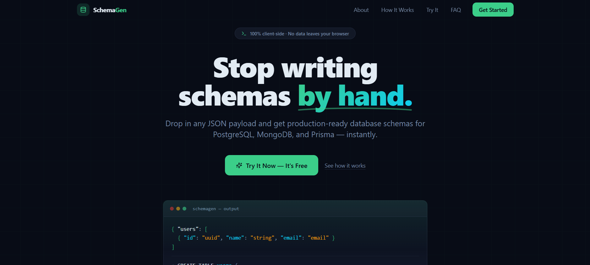
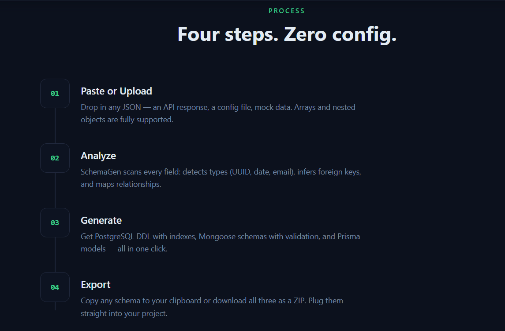
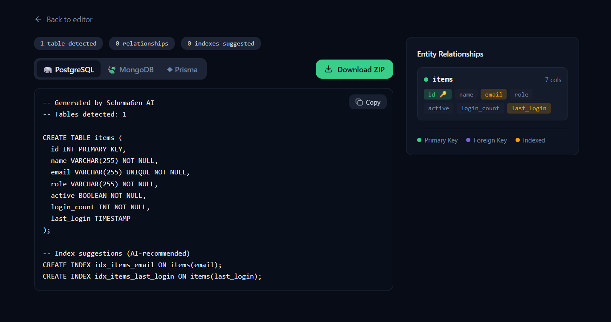

# SchemaGen AI

**Stop writing database schemas by hand.** Paste any JSON and get production-ready PostgreSQL, MongoDB, and Prisma schemas — instantly, privately, in your browser.

[Live Demo](#app) • [How It Works](#how-it-works) • [Report Bug](https://github.com/biswajit-sarkar-007/build-it-up/issues) • [Request Feature](https://github.com/biswajit-sarkar-007/build-it-up/issues)


---

## Demo

| JSON Input | Schema Output | Relationship Map |
| :---: | :---: | :---: |
|  |  |  |

video demo


---

## The Problem

Every time you work with a new API or dataset you end up:

- Manually translating JSON fields into column types and constraints
- Writing `CREATE TABLE` statements, Mongoose schemas, and Prisma models — three separate files for the same data
- Guessing foreign key relationships and index strategies
- Repeating this tedious, error-prone process for every project

**This is a waste of engineering time.**

---

## The Solution

**SchemaGen AI** converts any JSON payload into:

-  **PostgreSQL DDL** — with types, constraints, indexes, and foreign keys
-  **Mongoose / MongoDB schemas** — with validation, refs, and enums
-  **Prisma ORM models** — with relations, `@id`, `@unique`, and `@@index` directives

All processing happens **100% client-side**. Your data never leaves the browser. No sign-up, no API calls, no tracking.

---

## Features

- **Smart Type Inference** — detects UUIDs, emails, dates, URLs, enums, and booleans automatically
- **Nested Object Flattening** — nested JSON objects are extracted into separate related tables with proper foreign keys
- **Foreign Key Detection** — fields ending in `_id`, `Id`, or `_ID` are auto-linked to matching tables
- **Index Recommendations** — suggests indexes based on field patterns (foreign keys, timestamps, etc.)
- **Multi-Target Output** — one JSON input → three production-ready schemas (PostgreSQL, MongoDB, Prisma)
- **Copy & Download** — copy any schema to clipboard or download all three as a `.zip` file
- **File Upload & Drag-n-Drop** — paste JSON or upload a `.json` file (up to 2 MB)
- **Built-in Examples** — preloaded datasets (Users & Orders, Blog Posts, Flat Users) to try instantly
- **Entity Relationship Viewer** — visual map of tables, columns, primary keys, and foreign key links
- **Dark Theme** — sleek, modern dark UI with smooth animations
- **Fully Responsive** — works on desktop, tablet, and mobile
- **Zero Dependencies on Backend** — no server, no database, no auth required

---

## Tech Stack

| Layer | Technologies |
| :--- | :--- |
| **Framework** | React 18, TypeScript 5.8 |
| **Build Tool** | Vite 5 |
| **Styling** | Tailwind CSS 3, shadcn/ui (Radix UI primitives) |
| **Animations** | Framer Motion |
| **State / Data** | TanStack React Query |
| **Forms** | React Hook Form, Zod |
| **Utilities** | JSZip, FileSaver.js, date-fns, Lucide Icons |
| **Testing** | Vitest, React Testing Library, jsdom |
| **Linting** | ESLint 9, typescript-eslint |

---

## Quick Start

> **Prerequisites:** Node.js ≥ 18 and npm installed — [install with nvm](https://github.com/nvm-sh/nvm#installing-and-updating)

```bash
# Clone the repo
git clone https://github.com/biswajit-sarkar-007/build-it-up.git

# Navigate into the project
cd build-it-up

# Install dependencies
npm install

# Start the development server
npm run dev
```

The app will open at **http://localhost:5173**.

### Other scripts

| Command | Description |
| :--- | :--- |
| `npm run build` | Production build |
| `npm run preview` | Preview production build locally |
| `npm run lint` | Run ESLint across the project |
| `npm run test` | Run tests with Vitest |
| `npm run test:watch` | Run tests in watch mode |

---

## Project Structure

```
build-it-up/
├── public/                     # Static assets (demo screenshots, favicon, logo)
├── src/
│   ├── components/
│   │   ├── ui/                 # shadcn/ui primitives (49 components)
│   │   ├── Navbar.tsx          # Fixed navigation bar with mobile menu
│   │   ├── HeroSection.tsx     # Landing hero with animated code preview
│   │   ├── AboutSection.tsx    # Feature highlights (Why SchemaGen)
│   │   ├── HowItWorksSection.tsx  # 4-step process overview
│   │   ├── AppSection.tsx      # Main app — orchestrates input → analysis → output
│   │   ├── JsonInputPanel.tsx  # JSON paste / file upload / example loader
│   │   ├── SchemaOutputTabs.tsx   # Tabbed schema viewer (PostgreSQL, MongoDB, Prisma)
│   │   ├── RelationshipMap.tsx # Entity relationship visualizer
│   │   ├── TestimonialsSection.tsx # User testimonials
│   │   ├── FaqSection.tsx      # FAQ accordion
│   │   └── FooterSection.tsx   # Site footer
│   ├── hooks/
│   │   ├── use-mobile.tsx      # Responsive breakpoint hook
│   │   └── use-toast.ts       # Toast notification hook
│   ├── lib/
│   │   ├── jsonAnalyzer.ts     #  Core engine — type inference, FK detection, IR generation
│   │   ├── schemaGenerators.ts # PostgreSQL, Mongoose, Prisma code generators
│   │   ├── schemaIR.ts         # Intermediate Representation type re-exports
│   │   ├── exampleData.ts      # Built-in example JSON datasets
│   │   └── utils.ts            # Utility functions (cn helper)
│   ├── pages/
│   │   ├── Index.tsx           # Main landing page (composes all sections)
│   │   └── NotFound.tsx        # 404 page
│   ├── test/                   # Test setup and test files
│   ├── App.tsx                 # Root component (providers, router)
│   ├── main.tsx                # Entry point
│   └── index.css               # Global styles & design tokens
├── index.html                  # HTML entry with SEO meta tags
├── tailwind.config.ts          # Tailwind + custom theme configuration
├── vite.config.ts              # Vite configuration
├── vitest.config.ts            # Vitest configuration
├── tsconfig.json               # TypeScript configuration
├── components.json             # shadcn/ui configuration
└── package.json
```

---

## How It Works

The core engine runs a **4-stage pipeline** entirely in the browser:

```
JSON Input → Analyze → Intermediate Representation (IR) → Schema Code Generation
```

### Stage 1 — Parse & Normalize
Accept raw JSON (object or array), detect the top-level structure, and normalize into arrays of records per entity.

### Stage 2 — Type Inference
For each field across all rows, infer the most specific type using pattern matching:

| Pattern | Detected Type |
| :--- | :--- |
| `^[0-9a-f]{8}-...$` | UUID |
| `^[^@]+@[^@]+\.[^@]+$` | Email |
| `^\\d{4}-\\d{2}-\\d{2}...` | ISO Date |
| `^https?://...` | URL |
| Repeated small set of strings | Enum |
| `true` / `false` | Boolean |

### Stage 3 — Relationship Detection
- **Nested objects** → extracted into a separate table with a foreign key back to the parent
- **Nested arrays** → extracted into a child table with a foreign key reference
- **`*_id` / `*Id` fields** → matched against detected table names to establish FK links

### Stage 4 — Code Generation
The **Intermediate Representation (IR)** — containing tables, columns, relationships, and indexes — is fed into three independent generators:

| Generator | Output |
| :--- | :--- |
| `generatePostgreSQL()` | `CREATE TABLE` statements with types, constraints, indexes |
| `generateMongoose()` | `mongoose.Schema` definitions with refs, validation, enums |
| `generatePrisma()` | `model` blocks with `@id`, `@unique`, `@relation`, `@@index` |

---

## Roadmap

- [x] JSON → PostgreSQL DDL generation
- [x] JSON → Mongoose schema generation
- [x] JSON → Prisma model generation
- [x] Smart type inference (UUID, email, date, URL, enum)
- [x] Nested object & array → table flattening with FK
- [x] Entity relationship viewer
- [x] Copy to clipboard & ZIP download
- [x] Drag-and-drop file upload
- [x] Built-in example datasets
- [x] Dark mode UI with animations
- [ ] MySQL / MariaDB schema output
- [ ] GraphQL type definitions output
- [ ] SQLite schema output
- [ ] CLI version (npm package)
- [ ] VS Code extension
- [ ] JSON Schema / OpenAPI import
- [ ] Editable schema before export (visual editor)
- [ ] Schema diff — compare two JSON inputs

---

## Contributing

Contributions, issues, and feature requests are welcome!

1. **Fork** the repo
2. **Create** a feature branch (`git checkout -b feature/amazing-feature`)
3. **Commit** your changes (`git commit -m "feat: add amazing feature"`)
4. **Push** to the branch (`git push origin feature/amazing-feature`)
5. **Open** a Pull Request

---

## License

Distributed under the **MIT License**. See `LICENSE` for more information.

---

<p align="center">
  Built with  by <a href="https://github.com/biswajit-sarkar-007">Biswajit Sarkar</a>
</p>
